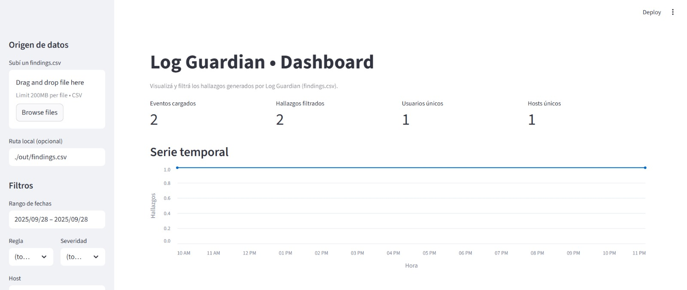
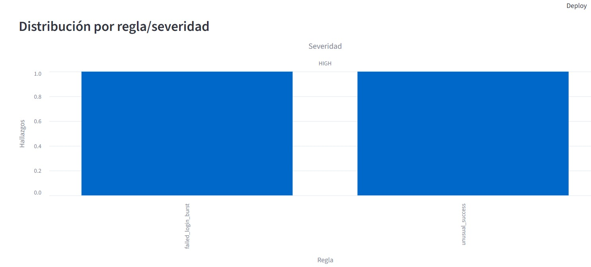
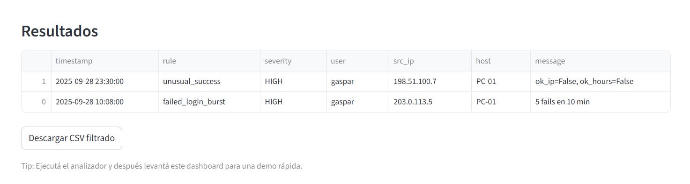

# Log Guardian

Análisis **defensivo** de logs (Windows y Linux) con detecciones listas para usar y foco en **automatización**:
- **Ráfagas de fallos de login** → Windows `4625` / Linux `Failed password`
- **Logins exitosos inusuales** → Windows `4624` / Linux `Accepted …` (IP no permitida y/o fuera de horario)
- **Escalada de privilegios** → Linux `sudo` / `su` (y opcional 4672/4688 si aparece en CSV de Windows)

Incluye **configuración por archivo**, **reporte CSV**, **alertas por correo** (Mailtrap/Gmail) y **dashboard Streamlit**. Viene con **tests** + **CI (GitHub Actions)**.

---

## Tabla de contenidos
- [Características](#características)
- [Estructura](#estructura)
- [Requisitos](#requisitos)
- [Instalación](#instalación)
- [Configuración (`config.toml`)](#configuración-configtoml)
- [Uso](#uso)
  - [Windows (CSV)](#windows-csv)
  - [Linux (`/var/log/auth.log`)](#linux-varlogauthlog)
  - [Alertas por correo (Mailtrap/Gmail)](#alertas-por-correo-mailtrapgmail)
- [Dashboard (Streamlit)](#dashboard-streamlit)
- [Flags (CLI)](#flags-cli)
- [Salida esperada](#salida-esperada)
- [Lógica de detección](#lógica-de-detección)
- [Troubleshooting](#troubleshooting)
- [Privacidad y buenas prácticas](#privacidad-y-buenas-prácticas)
- [Tests y CI](#tests-y-ci)
- [Roadmap](#roadmap)
- [Licencia](#licencia)

---

## 
- Parsers:
  - **Windows (CSV)**: exportado del *Security Log* (Visor de eventos).
  - **Linux (`/var/log/auth.log`)**: estilo Debian/Ubuntu (SSH + sudo/su).
- Reglas:
  - `failed_login_burst`: N fallos dentro de T minutos por **(usuario, IP)**.
  - `unusual_success`: éxito fuera de horario y/o desde IP fuera de **CIDRs** permitidos.
  - `privilege_escalation`: eventos de **sudo/su** (Linux) y 4672/4688 (Windows si están presentes).
- **Configurable** con `config.toml`.
- **Exporta CSV** con hallazgos.
- **Alertas por correo** (Mailtrap/Gmail) con umbral de severidad y **cooldown** (anti rate-limit).
- **Dashboard Streamlit** para visualizar resultados.
- **Tests** de reglas + **CI** en GitHub Actions.

---

## 
```text
Log_guardian/
├─ main.py
├─ config.toml
├─ samples/
│  ├─ security_sample.csv      # Windows
│  └─ auth_sample.log          # Linux
├─ tests/
│  └─ test_detectors.py
├─ app.py                      # Dashboard (Streamlit)
├─ requirements.txt            # streamlit, pandas, altair (opcional)
└─ .github/workflows/
   └─ ci.yml
```

> Recomendado: `.gitignore` con `.venv/`, `out/`, `*.csv`, `__pycache__/`, etc.

---

## 
- **Python 3.11+**
- Windows para exportar CSV del *Security Log* (o usar `samples/`).
- (Opcional) Linux/WSL/VM para `auth.log`.
- Entorno virtual recomendado.

---

## 
**PowerShell (Windows)**
```powershell
py -3 -m venv .venv
Set-ExecutionPolicy -Scope CurrentUser RemoteSigned
.\.venv\Scripts\Activate.ps1
python --version
```

---

## -blue)
```toml
[general]
business_hours = "08:00-20:00"        # Soporta ventanas nocturnas (p.ej., 22:00-06:00)

[rules.failed_login_burst]
threshold = 5                         # cantidad de fallos en la ventana
window_minutes = 10                   # ancho de ventana deslizante

[rules.unusual_success]
allowed_cidrs = ["10.0.0.0/8","192.168.0.0/16","172.16.0.0/12"]
enforce_business_hours = true

[alerts.email]
enabled = false                       # activar manualmente para pruebas
smtp_host = "sandbox.smtp.mailtrap.io"  # para Gmail: smtp.gmail.com
smtp_port = 587                       # Mailtrap: 587 o 2525
use_tls = true
username = "TU_USER_MAILTRAP"         # para Gmail: tu_email@gmail.com
from_addr = "logguardian@example.com" # en Gmail suele ser = username
to_addrs = ["test@local.test"]        # uno o más destinatarios
min_severity = "HIGH"                 # LOW | MEDIUM | HIGH
cooldown_seconds = 3                  # evita rate limit al probar seguido
```

---

## 

### Windows (CSV)
```powershell
python .\main.py --input .\samples\security_sample.csv --platform windows --config .\config.toml --out .\out\findings.csv
```

### Linux (`/var/log/auth.log`)
```powershell
python .\main.py --input .\samples\auth_sample.log --platform linux --config .\config.toml --out .\out\findings_linux.csv
```

### Alertas por correo (Mailtrap/Gmail)
**Mailtrap (pruebas):**
```powershell
$env:LOGGUARDIAN_SMTP_PASS="TU_PASSWORD_MAILTRAP"
python -c "import os; print(bool(os.getenv('LOGGUARDIAN_SMTP_PASS')))"  # True
# En config.toml: [alerts.email] enabled = true, min_severity = "LOW"
```
**Gmail (producción personal):**
- Requiere **2FA** y **App Password**.
- `smtp_host = "smtp.gmail.com"`, `smtp_port = 587`, `use_tls = true`.
- `username/from_addr = tu_email@gmail.com` y `LOGGUARDIAN_SMTP_PASS = <app password>`.

---

## Dashboard (Streamlit)

Visualizá los hallazgos con un tablero simple: filtros, KPIs, series temporales y tabla exportable.

**Instalación rápida**
```bash
pip install -r requirements.txt   # o: pip install streamlit pandas altair
streamlit run app.py
```

**Uso**
- En la barra lateral, subí un `findings.csv` o apuntá a `./out/findings.csv`.
- Filtrá por **fecha, regla, severidad, usuario, host e IP**.
- Descargá el **CSV filtrado** desde el botón al pie.

**Demo (capturas)**







---

## -blue)

| Flag         | Obligatorio | Valores              | Descripción                                 |
|--------------|-------------|----------------------|---------------------------------------------|
| `--input`    | Sí          | ruta a archivo       | CSV (Windows) o `auth.log` (Linux)          |
| `--platform` | Sí          | `windows` \| `linux` | Selecciona el parser                         |
| `--config`   | Sí          | ruta a `config.toml` | Configuración de reglas/alertas              |
| `--out`      | No          | ruta a CSV           | Archivo de salida (default: `findings.csv`)  |

---

## 
```text
Eventos: 7  |  Hallazgos: 2
Resumen de hallazgos:
  Por regla: failed_login_burst=1, unusual_success=1
  Por severidad: HIGH=2
CSV generado: .\out\findings.csv
```

**CSV (findings.csv):**
```csv
timestamp,rule,severity,user,src_ip,host,message
2025-09-28T10:08:00,failed_login_burst,HIGH,gaspar,203.0.113.5,PC-01,"5 fails en 10 min"
2025-09-28T23:30:00,unusual_success,HIGH,gaspar,198.51.100.7,PC-01,"ok_ip=False, ok_hours=False"
```

---

## 

### 1) `failed_login_burst` (fuerza bruta / spraying)
- Fuente: Windows **4625** / Linux **Failed password** (SSH).
- Agrupa por **(usuario, IP)**.
- Ventana deslizante de `window_minutes`; si el conteo alcanza `threshold` → **HIGH**.
- `message`: `"{n} fails en {window_minutes} min"`.

### 2) `unusual_success` (acceso exitoso anómalo)
- Fuente: Windows **4624** / Linux **Accepted …**.
- Chequeos:
  - IP ∈ `allowed_cidrs` → OK IP
  - Si `enforce_business_hours = true`, `timestamp ∈ business_hours` → OK horario
- Severidad:
  - **HIGH** si IP no permitida
  - **MEDIUM** si sólo fuera de horario

### 3) `privilege_escalation` (aumento de privilegios)
- Fuente: Linux **sudo/su** (y opcional Windows **4672/4688** si el CSV lo trae).
- Severidad por defecto: **MEDIUM** (ajustable).

---

## 
- **`TOMLDecodeError` en `config.toml`** → Evitá comillas “inteligentes”; guardá en **UTF-8**.
- **`getaddrinfo failed` (SMTP)** → revisá `smtp_host`; con Mailtrap: `sandbox.smtp.mailtrap.io`.
- **`530 Authentication Required` (Gmail)** → falta **App Password** o la variable `LOGGUARDIAN_SMTP_PASS` no está cargada.
- **`Too many emails per second` (Mailtrap)** → esperá 2–3 s entre corridas o subí `cooldown_seconds`.

---

## 
- No subas datos reales; usá `samples/`.
- Ajustá `allowed_cidrs` a tus rangos internos.
- `alerts.email.enabled = false` por defecto (evita envíos accidentales).
- Minimiza PII en mensajes/CSV.

---

## 
**Local:**
```powershell
python -m unittest
```
**CI:** GitHub Actions corre en cada push/PR. Workflow en `.github/workflows/ci.yml`.

---

## 
- Soporte `EVTX` (Windows) con `python-evtx`.
- Export **JSONL** + mini dashboard (Streamlit).
- Regla configurable por **agrupación** (`user_ip` | `ip` | `user`).
- Más señales Linux (PAM/sshd adicionales) y Windows (4672/4688 detallado).

---

## 
MIT — ver [`LICENSE`](./LICENSE).
